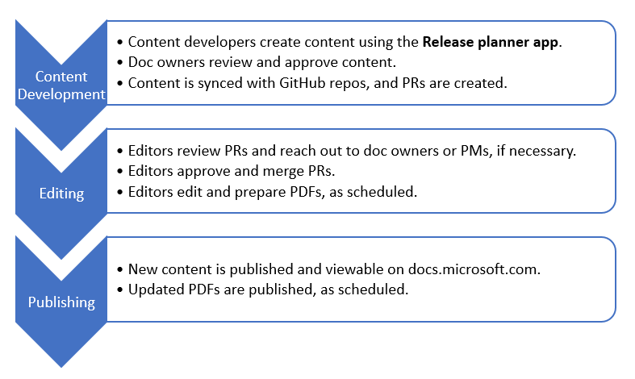

# Release plans guide

This guide provides information on how PMs, writers, content strategists, editors, and other team members can contribute to our official release plans content on [docs.microsoft.com](https://docs.microsoft.com/business-applications-release-notes/). This guide provides specific information about release plans from content development to publishing. 

> ![NOTE]
> Since this guide is specific to **Release plans**, there will be differences from the [Contributors' Guide for Docs](contributors-guide.md). In instances of conflct, this guide wins.

## Release plans lifecycle

## Current release plans

With the **2020 release wave 1 plans**, we implemented to following changes: 
- All release plans release prior to 2019 Wave 2 will no longer be updated.
- (Add info about ADO system for updates during publish)
- Add release plans email for publishing questions.

| Feature | Notes | PDF |
| -- | -- | -- |
| **Dynamics 365 2020 release wave 1 plan** | Coming soon. | Coming soon. |
| **Power Platform 2020 release wave 1 plan** | Coming soon. | Coming soon. |

## Previous release plans

With the **2019 release wave 2 plans**, we implemented the following changes:
- Changed the name to "release plans" from "release notes."

- Moved to new repos in GitHub.

- Split the content into two parts: Dynamics 365 and Power Platform. This includes publishing two separate PDFs.  

- Introduced the Release Planner app. PMs use this to input their feature information for the release plans. The information is pushed into GitHub and used for the BAG product roadmap. All content is created and updated int he release planner app.

| Feature | Notes | PDF |
| -- | -- | -- |
| **[Dynamics 365 release wave 2 plan](https://docs.microsoft.com/en-us/dynamics365-release-plan/2019wave2/)** | Updates are pushed to GitHub from the release planner app and published regularly. When changes are merged to master, they will be picked up with the next publish on Docs. | Updated regularly. |
| **[Power Platform release wave 2 plan](https://docs.microsoft.com/en-us/power-platform-release-plan/2019wave2/)** | Updates are pushed to GitHub from the release planner app and published regularly. When changes are merged to master, they will be picked up with the next publish on Docs. | Updated regularly. |
| **[April '19 release notes](https://docs.microsoft.com/en-us/business-applications-release-notes/April19/index)** | This release plan is archived, and will no longer be updated. | No longer updated. |
| **[October '18 release notes](https://docs.microsoft.com/en-us/business-applications-release-notes/October18/index)** | This release plan is archived, and will no longer be updated.s. | No longer updated. |
| **[April '18 release notes](https://docs.microsoft.com/en-us/business-applications-release-notes/April18/index)** | This release plan is archived, and will no longer be updated. | No longer updated. | 

