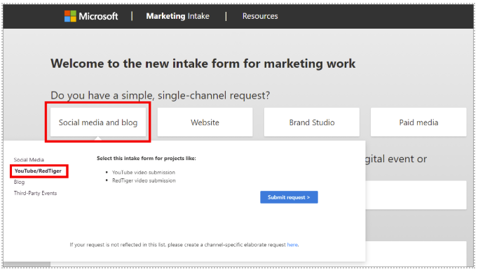

# Technical videos: Get started

This process is for PMs to use to create post-release demo videos about their features for customer engagement apps and some Power Platform apps.  

Your contacts are Abhinav Dhankar (abdhanka) and your writer. 

## Create a video

1.	When a PM is planning a video, they let their writer know about their plans. Ideally, the PM and writer discuss videos as part of the product documentation planning. 
2. The PM writes a short script that explains how to do something. The script should be about 1 page. See [Sample scripts](tv-sample-scripts.md) for examples or contact your writer for help. 
3. CP (both your writer and Abhinav) reviews the script. 
4. The PM records the video and voiceover using Camtasia. 
5. CP edits the video. 
6. The PM views and sign off on the video.
7. CP does production work so the video can be published to [YouTube](https://www.youtube.com/channel/UCJGCg4rB3QSs8y_1FquelBQ) and RedTiger (the Microsoft video hosting service).

### Use Camtasia
You will need Camtasia to do the screen capture for your video. If you don't have a license for it, contact your organization's admin group for assistance. CP does not get Camtasia licenses for PMs. 

Set up Camtasia on your computer, including screen resolution and other settings for screen capture and audio. Here is a video to help you: [Camtasia settings](https://nam06.safelinks.protection.outlook.com/?url=https%3A%2F%2Fmicrosoft.sharepoint.com%2F%3Av%3A%2Ft%2FCRMHOME%2Fua%2FEbRnMc8iTLFFtKVFgXwgfvgBqoJ0UYoczV-5rQ3xWukywQ%3Fe%3DOg0W2b&data=02%7C01%7Crenwe%40microsoft.com%7Cf53f9eba2e55431f2b9708d7e111f887%7C72f988bf86f141af91ab2d7cd011db47%7C1%7C0%7C637225339637970339&sdata=eRO8yWqnhOIy5Ie5uvanKLzySFZYzFTC8H6Zge%2FC6nw%3D&reserved=0) <br>

Use these guidelines: [Screen capture guidelines](https://nam06.safelinks.protection.outlook.com/ap/w-59584e83/?url=https%3A%2F%2Fmicrosoft.sharepoint.com%2F%3Aw%3A%2Ft%2FAlchemy%2FEa8PejgWzWhCnrleOlx5SYABru5dTRwSukHKmxxBSMNwEg%3Fe%3DW6TebI&data=02%7C01%7Crenwe%40microsoft.com%7C94c11c2b93c94696b12d08d7dc8f98cd%7C72f988bf86f141af91ab2d7cd011db47%7C1%7C0%7C637220381621818780&sdata=1K1jVt3CDw7DveIE00cUfQvTubmthGuFFpaprfDB29M%3D&reserved=0)

### Use only approved sample data and fictitious content
One of the most time-consuming fixes needed on videos is when someone uses the information and pictures of real people and companies. When you record your video, use a clean environment with only sample data for recording the demo. It must not contain any junk data/personal data or we cannot publish it until that is fixed. 

Please use only Microsoft-approved fictitious company names, URLs, people names and pictures, email addresses, phone numbers, and other data in the demo: [Microsoft-approved fictitious content lists](https://microsoft.sharepoint.com/sites/lcaweb/home/copyrights-trademarks-and-patents/trademarks/fictitious-names#)

If you need just a few names and your product doesn't have sample data, you can use these names we got pre-approved by CELA: [Dynamics 365 approved people names for FY20](https://review.docs.microsoft.com/en-us/bacx/fictitious-names?branch=master)

### Avoiding redos
Please note when you do the original Camtasia recording, you will probably have to do it a second time after you get our feedback. You can avoid a lot of churn by following the [screen capture guidelines](https://nam06.safelinks.protection.outlook.com/ap/w-59584e83/?url=https%3A%2F%2Fmicrosoft.sharepoint.com%2F%3Aw%3A%2Ft%2FAlchemy%2FEa8PejgWzWhCnrleOlx5SYABru5dTRwSukHKmxxBSMNwEg%3Fe%3DW6TebI&data=02%7C01%7Crenwe%40microsoft.com%7C94c11c2b93c94696b12d08d7dc8f98cd%7C72f988bf86f141af91ab2d7cd011db47%7C1%7C0%7C637220381621818780&sdata=1K1jVt3CDw7DveIE00cUfQvTubmthGuFFpaprfDB29M%3D&reserved=0). 

Here are some common things that cause redos:

- Audio levels and quality
- Verbal flubs and surprise background noise (saying "um", repeating or interrupting yourself, background noise (dog barking, horn honk); basically any distracting sounds we can't edit out
- Wrong screen resolution
- Use of non-approved demo data (fictitious content)
- Mouse movements that distract on screen
- Flow of video and use of transitional graphics/images - don't talk about the new thing while still on the old screen

## Upload a video

PMs: After you have created your video, you can upload it to RedTiger (Microsoft'video hosting platform) and/or to the offcial product's YouTube channel by using the intake form at <https://badeintake.azurewebsites.net/>

### File requirements 

You need to provide these 4 files for publishing on both platforms (YouTube and Red Tiger). 

- Video file in .MP4 format. 
- Caption file in .SRT format. 
- Caption file in .TTML format. 
- Audio description file in .MP3 format. 

> [!NOTE] 
> If you want to [embed videos in a docs article](#embed-a-video-in-docs), it must be uploaded to RedTiger.

**For publishing only on YouTube** 

- Video file in .MP4 format. 
- Caption file in .SRT format. 

**For publishing only on RedTiger**  
- Video file in .MP4 format. 
- Caption file in .TTML format. 
- Audio description file in .MP3 format. 

### Submitting videos to be uploaded to YouTube and RedTiger 

Following information is required at the time of submitting the request to video publishing team along with the files as mentioned earlier: 

- Video Title 

- Video Description  Please provide a detailed description including 2-4 key points you want your audience to know about your video. 

- Video tags/Keywords (SEO)  Provide keywords associated with your video including but not limited to Microsoft products, event names, speakers, industry keywords, product features, etc. 

- Provide a clear CTA and URL/landing page for the viewer. Please do not include non-published CTA Links.

You need to submit an intake form here: <https://badeintake.azurewebsites.net/>; select the **Social media and blog** > **YouTube/RedTiger** option. 



> [!NOTE]
> Contact Abhinav Dhankar if you have an questions.

## Embed a video in docs

After your video is uploaded to RedTiger, you get a link to your video on RedTiger. For example: https://www.microsoft.com/videoplayer/embed/{ID}.

Please note due to accessibility issues, we embed only RedTiger links. We do not embed YouTube links.

You can embed the video in your docs article by using the following markdown syntax:

```markdown
> [!VIDEO https://www.microsoft.com/videoplayer/embed/{ID}]
```
